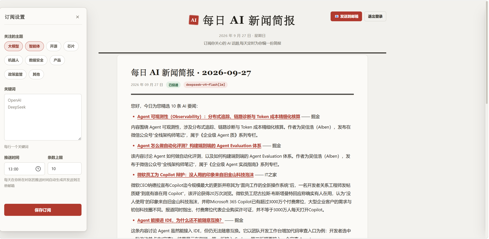

# 每日 AI 新闻简报

自托管的个性化 AI 新闻日报:注册账号 → 订阅你关注的主题与关键词 → 每天定时自动生成一份中文简报,**推送到你的邮箱**。对简报内容点赞/点踩,系统学习你的口味,越用越懂你。



## 快速开始

### 依赖

- Python 3.12+
- Docker(数据库用 pgvector 容器)

### 安装与启动

依次执行:

```bash
git clone https://github.com/AnthonyXiang223/Dailynews.git
cd Dailynews
python -m venv .venv
source .venv/Scripts/activate
pip install -e .
cp .env.example .env
```

macOS/Linux 用户把 `source .venv/Scripts/activate` 换成 `source .venv/bin/activate`。

编辑 `.env`,填入你的 LLM key:

```bash
LLM_API_KEY=sk-你的key
```

也可切换任意 OpenAI 兼容服务:修改 `LLM_PROVIDER` / `LLM_BASE_URL` / `LLM_MODEL` 三项。

继续:

```bash
docker compose up -d
alembic upgrade head
python -m dailynews
```

打开 http://127.0.0.1:8000 注册账号开始使用。

### 使用流程

1. **注册账号**(邮箱 + 密码)——邮箱即登录名,也是简报的收件地址
2. **订阅偏好**:左侧悬浮边栏勾选主题、填写关键词,并设置每日推送时间和条数上限
3. **立即生成**:右侧边栏点「⚡ 立即生成今日简报」,几分钟后简报出现在中央阅读区(手动生成不发邮件)
4. **发送到邮箱**:内容满意后点右上角「📧 发送到邮箱」
5. **定时投送**:到了你设置的推送时间(默认每天 08:00),服务自动生成并发到邮箱——**到点前服务必须保持运行**

### 邮箱推送(可选但推荐)

简报默认打印在服务端控制台。想收到邮件,在 `.env` 配置 SMTP(这里示例QQ邮箱):

```bash
SMTP_HOST=smtp.qq.com
SMTP_PORT=465
SMTP_USER=你的发件邮箱@qq.com
SMTP_PASSWORD=你的SMTP授权码     # QQ 邮箱:设置→账户→开启 SMTP 服务后生成,不是登录密码
SMTP_FROM=你的发件邮箱@qq.com
```

## 已知限制

- **单机部署**:调度在进程内,定时投送时服务必须运行;多实例需迁移 Celery/Temporal
- **无 HTTPS**:鉴权 token 走明文 HTTP,公网部署请置于反向代理后
- **RSS 依赖源站可用性**:36氪/机器之心等反爬站点的源未覆盖,可自建 [RSSHub](https://docs.rsshub.app/) 补充


